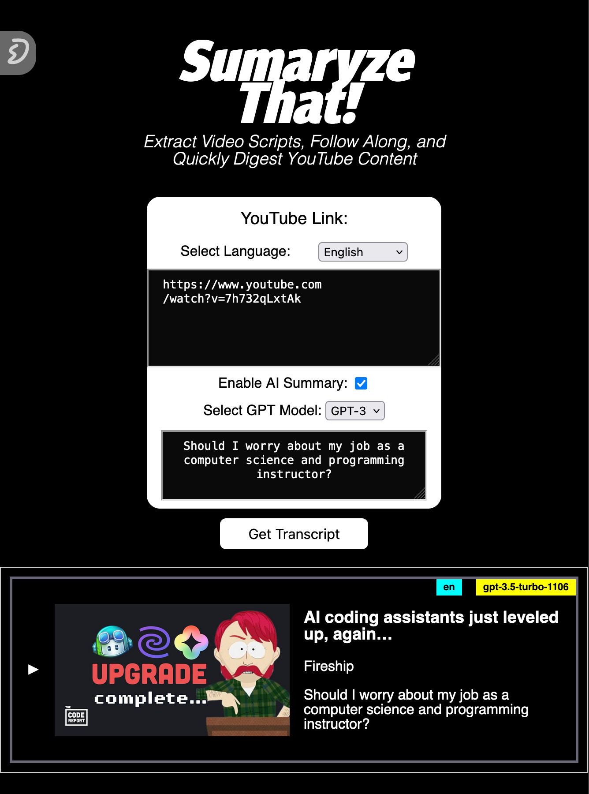
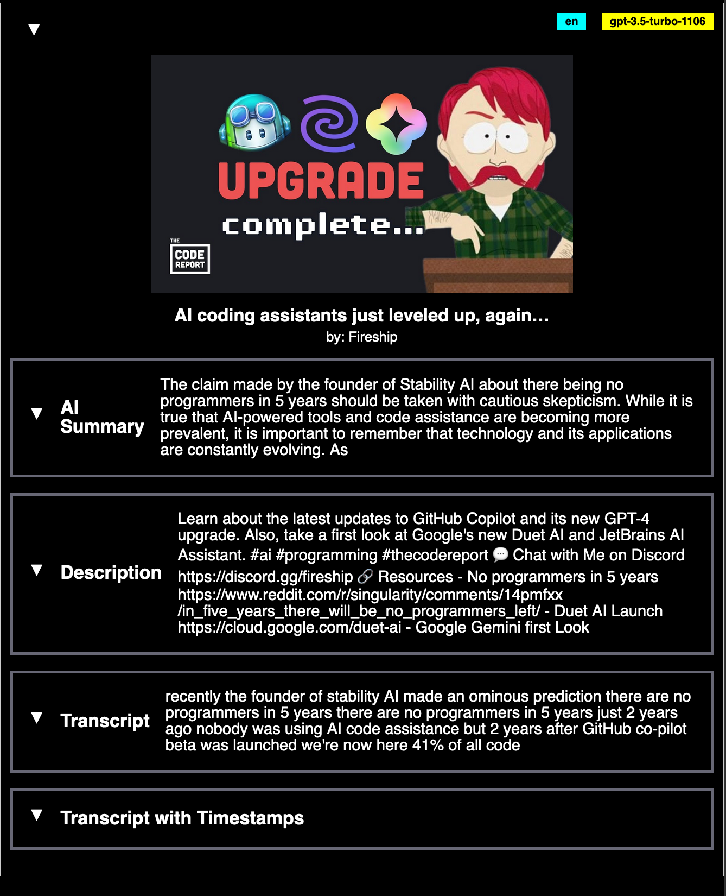

# SUMMARIZE THAT!

<!-- <div style="display: flex; justify-content: space-around;">
   
   
</div> -->

<!-- add image in mardown-->
<!-- 
 -->

<div style="display: flex; justify-content: space-around; align-items: center;">
   
   
</div>

**"SUMMARIZE THAT!"** is a powerful Flask application designed to streamline your video content consumption.  
Leveraging the capabilities of the YouTube Transcript API and Google API client, it fetches and processes video transcripts with ease.

But it doesn't stop there!

If enabled, it can also utilize OpenAI's advanced technology to provide concise and accurate summaries of the video content.

Whether you're a student trying to review lecture videos, a professional catching up on the latest industry talks, or just someone who loves to learn, "SUMMARIZE THAT!" can help you save time and focus on the key points.

Try it out now and experience a new way of consuming video content!

## Live

https://danielsegarra36.pythonanywhere.com/  
https://replit.com/@DanielSegarra36/SUMMARIZE-THESE

Feel free to try it out on REPLIT!  
Fork your own copy and make sure to set your own API keys in REPLIT's secret manager.

## Getting Started

These instructions will get you a copy of the project up and running on your local machine for development and testing purposes.

### Prerequisites

What things you need to install the software and how to install them:

- Python
- Flask
- youtube_transcript_api
- google-api-python-client
- openai

### Set Your API Keys

_make sure you set this in the same shell you'll use to run the flask server_

1. Set your YouTube API key as an environment variable:
   ```
   export YOUTUBE_API_KEY=your_api_key
   ```
2. Set your OpenAI API key as an environment variable:
   ```
   export OPENAI_API_KEY=your_api_key
   ```

### Installing

A step by step series of examples that tell you how to get a development environment running:

1. Clone the repository
   ```
   git clone https://github.com/DanielSegarra36/SUMMARIZE-THESE
   ```

#### Manual

2. Use a virtual environment
   ```
   python3 -m venv .venv
   . .venv/bin/activate
   ```
3. Install the dependencies using pip:
   ```
   pip install Flask youtube_transcript_api google-api-python-client openai
   ```
4. Run the Flask application:
   ```
   python -m flask --app main run
   python main.py
   ```

#### Using pipx & poetry

[pipx](https://github.com/pypa/pipx#on-macos) is used to install Python CLI applications globally while still **_isolating them in virtual environments_**.

[Poetry](https://python-poetry.org/docs/#installation) is a tool for dependency management and packaging in Python.  
It allows you to declare the libraries your project depends on and it will manage (install/update) them for you.  
Poetry offers a lockfile to ensure **_repeatable installs_**, and can build your project for distribution.

2. [install pipx](https://github.com/pypa/pipx#install-pipx) using `brew` / `apt` / `pip` / `scoop`

   ##### On macOS

   ```
   brew install pipx
   pipx ensurepath
   ```

   Upgrade pipx with `brew update && brew upgrade pipx`.

   ##### On Linux

   - Ubuntu 23.04 or above

   ```
   sudo apt update
   sudo apt install pipx
   pipx ensurepath
   ```

   - Ubuntu 22.04 or below

   ```
   python3 -m pip install --user pipx
   python3 -m pipx ensurepath
   ```

   Upgrade pipx with `python3 -m pip install --user --upgrade pipx`.

   ##### On Windows

   - install via [Scoop](https://scoop.sh/)

   ```
   scoop install pipx
   pipx ensurepath
   ```

   Upgrade pipx with `scoop update pipx`.

   - install via pip (requires pip 19.0 or later)

   ```
   # If you installed python using Microsoft Store, replace `py` with `python3` in the next line.
   py -m pip install --user pipx
   ```

3. install poetry

   ```
   pipx install poetry
   ```

4. Ensure poetry uses a python version allowed by `pyproject.toml` _(i.e. `python = ">=3.10.0,<3.11"`)_

   ```
   which python3
   ```

   use the path from there to

   ```
   poetry env use /PATH/TO/python3
   ```

5. install app dependencies

   ```
   poetry install
   ```

6. [run](https://python-poetry.org/docs/basic-usage/#using-poetry-run) the app

   ```
   poetry run python main.py
   ```

7. SUCCESS!!!

   ```
   Running on http://localhost:5000
   ```

## Running the tests

Explain how to run the automated tests for this system.

## Deployment

Add additional notes about how to deploy this on a live system.

## Built With

- [Flask](http://flask.pocoo.org/) - The web framework used
- [YouTube Transcript API](https://github.com/jdepoix/youtube-transcript-api) - Used to fetch video transcripts
- [Google API Client](https://developers.google.com/api-client-library/python/) - Used to interact with Google services _(YouTube)_
- [OpenAI](https://openai.com/) - Used for AI capabilities

## Authors

- **Daniel Segarra** - _Initial work_ - [DanielSegarra36](https://github.com/DanielSegarra36)

## License

This project is licensed under the MIT License - see the [LICENSE](LICENSE) file for details

## Acknowledgments

- Hat tip to anyone whose code was used
- Inspiration
- etc

## Resources

- openai docs: https://platform.openai.com/docs/guides/chat
- youtube docs:
  - https://developers.google.com/youtube/v3/docs/videos/list
  - https://developers.google.com/youtube/v3/docs/playlist/list
  - https://developers.google.com/youtube/v3/docs/playlistItems/list
